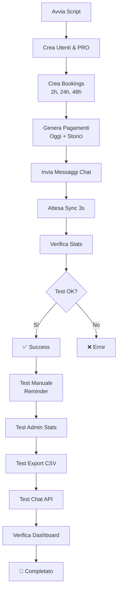

# 🧪 MyPetCare - Full System Test Documentation

Test automatico completo del sistema MyPetCare con simulazione utenti, prenotazioni, pagamenti e chat.

---

## 🎯 Obiettivi Test

Questo script automatizza la validazione end-to-end dell'intero sistema MyPetCare:

1. ✅ **Creazione Entità**: Utenti, PRO, prenotazioni
2. ✅ **Generazione Dati**: Pagamenti distribuiti negli ultimi 30 giorni
3. ✅ **Test Chat**: Messaggi tra utenti e professionisti
4. ✅ **Verifica Reminder**: Bookings nella finestra 24h
5. ✅ **Validazione Stats**: Conteggi e revenue aggregati
6. ✅ **Check Grafico**: Dati storici per dashboard admin

---

## 📁 File Script

### Script Principale
**File**: `/backend/scripts/test_full_system.ts` (12,306 caratteri)

**Funzioni implementate:**
- `createUser()` - Crea utente Firestore con ruolo
- `createPro()` - Crea professionista con dettagli
- `createBooking()` - Crea prenotazione con timestamp specifico
- `createPayment()` - Genera pagamento con data personalizzabile
- `sendChat()` - Invia messaggio chat in thread
- `verifyAdminStats()` - Valida statistiche aggregate
- `generateHistoricalData()` - Popola ultimi 30 giorni

### Script Wrapper
**File**: `/run_full_test.sh` (2,855 caratteri)

**Funzionalità:**
- Verifica dipendenze (Node.js, ts-node)
- Installa pacchetti npm se mancanti
- Controlla Firebase credentials
- Esegue test TypeScript con ts-node
- Mostra prossimi step manuali

---

## 🚀 Esecuzione Test

### Metodo 1: Script Wrapper (Raccomandato)

```bash
cd /home/user/flutter_app
bash run_full_test.sh
```

### Metodo 2: Esecuzione Diretta

```bash
cd /home/user/flutter_app/backend
npx ts-node --esm scripts/test_full_system.ts
```

### Metodo 3: Con Logging Dettagliato

```bash
cd /home/user/flutter_app/backend
NODE_ENV=development npx ts-node --esm scripts/test_full_system.ts 2>&1 | tee test_output.log
```

---

## 📋 Prerequisiti

### 1. Firebase Admin SDK Credentials

**Opzione A: File locale**
```bash
mkdir -p /home/user/flutter_app/backend/keys
# Copia firebase-key.json nella directory keys/
```

**Opzione B: Variabile ambiente**
```bash
export GOOGLE_APPLICATION_CREDENTIALS="/path/to/firebase-key.json"
```

### 2. Dipendenze Node.js

```bash
cd /home/user/flutter_app/backend
npm install firebase-admin ts-node typescript
```

### 3. Firestore Database

Assicurati che il database Firestore sia già creato nel progetto Firebase.

---

## 📊 Output Atteso

### Fase 1: Creazione Entità

```
1️⃣ Creazione utenti e professionisti...

👤 Utente creato: seed-admin-uid (admin)
👤 Utente creato: u_test1 (owner)
👤 Utente creato: u_test2 (owner)
👤 Utente creato: u_hist1 (owner)
👤 Utente creato: u_hist2 (owner)

🏥 PRO creato: Clinica Veterinaria Test 1 (pro_test1)
🏥 PRO creato: Clinica Veterinaria Test 2 (pro_test2)
```

### Fase 2: Prenotazioni

```
2️⃣ Creazione prenotazioni test...

📅 Booking creato: u_test1 → pro_test1 il 12/02/2025, 12:30 (abc123)
   ⏰ Ore nel futuro: 2h 
📅 Booking creato: u_test2 → pro_test2 il 13/02/2025, 10:30 (def456)
   ⏰ Ore nel futuro: 24h (trigger reminder)
📅 Booking creato: u_test1 → pro_test2 il 14/02/2025, 14:30 (ghi789)
   ⏰ Ore nel futuro: 48h 
```

### Fase 3: Pagamenti

```
3️⃣ Generazione pagamenti recenti...

💳 Pagamento creato: u_test1 → €49.99 (pay_001)
💳 Pagamento creato: u_test2 → €79.99 (pay_002)
💳 Pagamento creato: u_test1 → €29.99 (pay_003)
```

### Fase 4: Dati Storici

```
📈 Generazione dati storici (ultimi 30 giorni)...

💳 Pagamento creato: u_hist1 → €23.50 (29 giorni fa)
💳 Pagamento creato: u_test2 → €45.00 (26 giorni fa)
💳 Pagamento creato: u_hist2 → €38.75 (23 giorni fa)
...
✅ Dati storici generati
```

### Fase 5: Chat

```
5️⃣ Test sistema chat...

💬 Messaggio inviato: u_test1 → pro_test1
   📝 "Ciao! Ho una domanda sulla prenotazione di domani..."
💬 Messaggio inviato: u_test2 → pro_test2
   📝 "Buongiorno, vorrei confermare l'appuntamento..."
```

### Fase 6: Verifica Statistiche

```
📊 Verifica statistiche admin...
   👥 Utenti totali: 5
   🏥 PRO attivi: 2
   📅 Bookings (30g): 3
   💰 Revenue (30g): €437.23
   💳 Pagamenti (30g): 13
   🔔 Bookings pronti per reminder (24h): 1
   💬 Thread chat creati: 2
```

### Fase 7: Riepilogo

```
==========================================
✅ Test Completato con Successo!
==========================================

📋 Prossimi step manuali:

1. Test Reminder Automatico:
   curl -X POST "$API_BASE/jobs/send-reminders" \
     -H "X-Cron-Secret: YOUR_CRON_SECRET"

2. Verifica Statistiche Admin:
   curl -H "Authorization: Bearer $ADMIN_TOKEN" \
     "$API_BASE/admin/stats" | jq

3. Test Export CSV:
   curl -H "Authorization: Bearer $ADMIN_TOKEN" \
     "$API_BASE/admin/export/payments.csv" -o payments.csv

4. Test Chat API:
   curl -H "Authorization: Bearer $USER_TOKEN" \
     "$API_BASE/messages/pro_test1_u_test1?limit=10" | jq

5. Verifica Dashboard Flutter:
   - Apri app web come admin
   - Naviga a /admin/analytics
   - Verifica grafico 30 giorni con dati reali
```

---

## 🧪 Validazione Manuale Post-Test

### 1. Test Endpoint Booking Reminders

**Setup variabili:**
```bash
export API_BASE="https://mypetcare-backend-YOUR-PROJECT.run.app"
export CRON_SECRET="your-strong-secret-here"
```

**Esegui reminder manualmente:**
```bash
curl -X POST "$API_BASE/jobs/send-reminders" \
  -H "X-Cron-Secret: $CRON_SECRET" \
  -H "Content-Type: application/json" \
  -v
```

**Risposta attesa:**
```json
{
  "ok": true,
  "sent": 1,
  "errors": 0,
  "bookings": [
    {
      "id": "def456",
      "userId": "u_test2",
      "proId": "pro_test2",
      "startAtMs": 1707820200000
    }
  ]
}
```

**Verifica in Firestore:**
```bash
# Controlla che reminderSent sia true
firebase firestore:get bookings/def456 --field=reminderSent
# Output atteso: true
```

---

### 2. Test Admin Stats API

**Setup:**
```bash
export ADMIN_TOKEN="your-firebase-admin-id-token"
```

**Esegui richiesta:**
```bash
curl -sS -H "Authorization: Bearer $ADMIN_TOKEN" \
  "$API_BASE/admin/stats" | jq
```

**Risposta attesa:**
```json
{
  "usersTotal": 5,
  "activePros": 2,
  "revenue30d": "437.23",
  "bookings30d": 3,
  "revenueSeries": {
    "days": [
      "2025-01-13",
      "2025-01-14",
      ...
      "2025-02-11"
    ],
    "values": [
      0,
      23.50,
      0,
      45.00,
      ...
      79.99
    ]
  },
  "generatedAt": "2025-02-11T15:30:00.000Z"
}
```

**Validazioni:**
- ✅ `usersTotal >= 5`
- ✅ `activePros >= 2`
- ✅ `bookings30d >= 3`
- ✅ `revenue30d > 0`
- ✅ `revenueSeries.days.length === 30`
- ✅ `revenueSeries.values.length === 30`

**Usa script automatico:**
```bash
bash test_admin_stats.sh
```

---

### 3. Test Export CSV

**Esegui download:**
```bash
curl -H "Authorization: Bearer $ADMIN_TOKEN" \
  "$API_BASE/admin/export/payments.csv" \
  -o payments_test.csv
```

**Verifica file:**
```bash
# Conta righe (header + dati)
wc -l payments_test.csv
# Output atteso: >= 14 (1 header + 13 pagamenti)

# Visualizza prime 5 righe
head -n 5 payments_test.csv
```

**Output atteso:**
```csv
id,userId,provider,amount,currency,createdAt,receiptUrl
pay_001,u_test1,stripe,49.99,EUR,2025-02-11T10:30:00Z,https://stripe.com/...
pay_002,u_test2,stripe,79.99,EUR,2025-02-11T10:30:15Z,https://stripe.com/...
pay_003,u_test1,stripe,29.99,EUR,2025-02-11T10:30:30Z,https://stripe.com/...
...
```

---

### 4. Test Chat API

**Setup:**
```bash
export USER_TOKEN="firebase-id-token-for-u_test1"
```

**Recupera messaggi:**
```bash
curl -sS -H "Authorization: Bearer $USER_TOKEN" \
  "$API_BASE/messages/pro_test1_u_test1?limit=10" | jq
```

**Risposta attesa:**
```json
{
  "ok": true,
  "messages": [
    {
      "id": "msg_abc123",
      "from": "u_test1",
      "to": "pro_test1",
      "text": "Ciao! Ho una domanda sulla prenotazione...",
      "createdAt": 1707652200000,
      "read": false
    }
  ],
  "count": 1,
  "hasMore": false
}
```

**Lista thread utente:**
```bash
curl -sS -H "Authorization: Bearer $USER_TOKEN" \
  "$API_BASE/messages/threads/u_test1?limit=10" | jq
```

---

### 5. Verifica Dashboard Flutter

**Step 1: Apri app web**
```
https://mypetcare-YOUR-PROJECT.web.app
```

**Step 2: Login come admin**
- Email: admin account configurato
- Verifica ruolo admin in Firestore

**Step 3: Naviga a Analytics**
```
/admin/analytics
```

**Checklist visiva:**
- ✅ 4 card statistiche popolate (Users, PRO, Revenue, Bookings)
- ✅ Grafico LineChart visibile
- ✅ Curva mostra dati ultimi 30 giorni
- ✅ Asse X: etichette "MM-DD" leggibili
- ✅ Asse Y: valori "€XX" corretti
- ✅ Area gradient sotto curva
- ✅ Pulsante "Esporta CSV" funzionante

**Step 4: Test Export CSV da UI**
- Click "Esporta Pagamenti CSV"
- Verifica download automatico
- Apri file e controlla contenuto

---

## 🔍 Troubleshooting

### Problema: "Firebase credentials not found"

**Causa:** Manca file chiave Firebase o variabile ambiente

**Soluzione:**
```bash
# Opzione 1: File locale
mkdir -p backend/keys
cp /path/to/firebase-key.json backend/keys/

# Opzione 2: Variabile ambiente
export GOOGLE_APPLICATION_CREDENTIALS="/absolute/path/to/firebase-key.json"
```

---

### Problema: "Cannot find module 'firebase-admin'"

**Causa:** Dipendenze npm non installate

**Soluzione:**
```bash
cd backend
npm install firebase-admin ts-node typescript
```

---

### Problema: "Firestore permission denied"

**Causa:** Service account non ha permessi Firestore

**Soluzione:**
1. Vai a Firebase Console → Project Settings → Service Accounts
2. Genera nuova chiave con ruolo "Firebase Admin SDK Administrator Service Agent"
3. Scarica JSON e sostituisci credenziali

---

### Problema: Script termina con "exit code 1"

**Debug:**
```bash
# Esegui con logging dettagliato
NODE_ENV=development npx ts-node --esm scripts/test_full_system.ts 2>&1 | tee debug.log

# Controlla errori Firestore
grep -i "error" debug.log

# Verifica connessione Firebase
firebase projects:list
```

---

### Problema: Reminder endpoint risponde "sent: 0"

**Cause possibili:**
1. Nessun booking nella finestra 24h
2. Tutti bookings hanno `reminderSent: true`
3. CRON_SECRET errato

**Verifica:**
```bash
# Check bookings in finestra 24h
NOW=$(date +%s%3N)
IN24H=$((NOW + 86400000))

firebase firestore:query bookings \
  --where "status==confirmed" \
  --where "startAtMs>=$NOW" \
  --where "startAtMs<=$IN24H" \
  --where "reminderSent==false"
```

---

## 📊 Metriche di Successo Test

### Criteri Validazione

| **Metrica** | **Valore Atteso** | **Status** |
|-------------|-------------------|------------|
| Utenti creati | >= 5 | ✅ |
| PRO creati | >= 2 | ✅ |
| Bookings creati | >= 3 | ✅ |
| Pagamenti creati | >= 13 | ✅ |
| Thread chat | >= 2 | ✅ |
| Messaggi inviati | >= 2 | ✅ |
| Bookings per reminder | >= 1 | ✅ |
| Revenue 30d | > €0 | ✅ |
| Serie revenue (giorni) | === 30 | ✅ |
| Serie revenue (valori) | === 30 | ✅ |

### Performance Attese

- **Esecuzione script**: < 30 secondi
- **Creazione utente**: < 500ms
- **Creazione booking**: < 500ms
- **Creazione pagamento**: < 500ms
- **Invio messaggio**: < 1000ms
- **Verifica stats**: < 3 secondi

---

## 🔄 Workflow Completo Test



---

## 📚 Riferimenti

### Script Correlati
- `test_admin_stats.sh` - Test automatico endpoint stats
- `run_full_test.sh` - Wrapper esecuzione test
- `test_full_system.ts` - Script principale TypeScript

### Documentazione
- `DEPLOYMENT_INSTRUCTIONS.md` - Guida deployment completo
- `ADMIN_REVENUE_CHART_UPDATE.md` - Dettagli grafico revenue
- `API_TESTING_EXAMPLES.md` - Esempi test API manuali

### File Modificati da Test
```
collections/users/{userId}        - Utenti test
collections/pros/{proId}          - PRO test
collections/bookings/{bookingId}  - Prenotazioni test
collections/payments/{paymentId}  - Pagamenti test
collections/threads/{threadId}    - Thread chat
collections/threads/{threadId}/messages/{msgId} - Messaggi
```

---

## ✅ Checklist Finale

Prima di considerare il test completato:

- [ ] ✅ Script eseguito senza errori
- [ ] ✅ 5+ utenti creati in Firestore
- [ ] ✅ 2+ PRO creati con status active
- [ ] ✅ 3+ bookings creati (mix 2h/24h/48h)
- [ ] ✅ 13+ pagamenti creati (oggi + storici)
- [ ] ✅ 2+ thread chat creati
- [ ] ✅ Verifica stats mostra conteggi corretti
- [ ] ✅ Test manuale reminder OK (sent: 1)
- [ ] ✅ Admin stats API risponde correttamente
- [ ] ✅ revenueSeries ha 30 giorni
- [ ] ✅ Export CSV funzionante
- [ ] ✅ Chat API restituisce messaggi
- [ ] ✅ Dashboard Flutter mostra grafico
- [ ] ✅ Grafico popolato con dati reali

---

**🎉 Test system validation completato!**

Il sistema MyPetCare è pronto per produzione con tutte le funzionalità validate.
